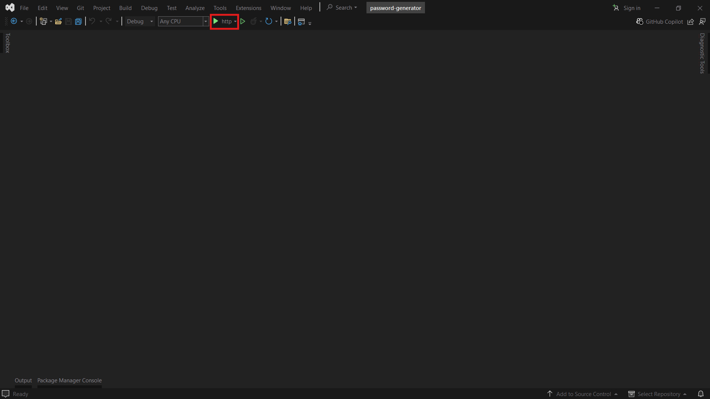
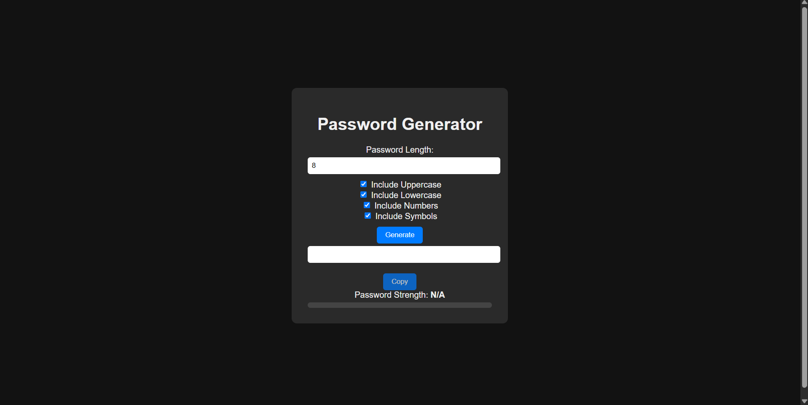
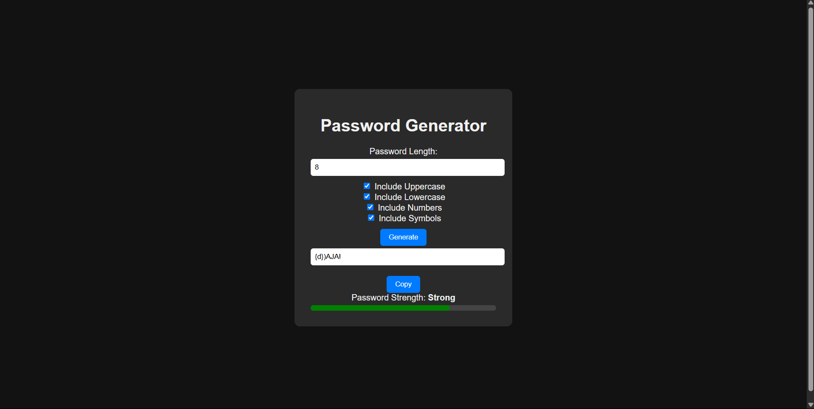
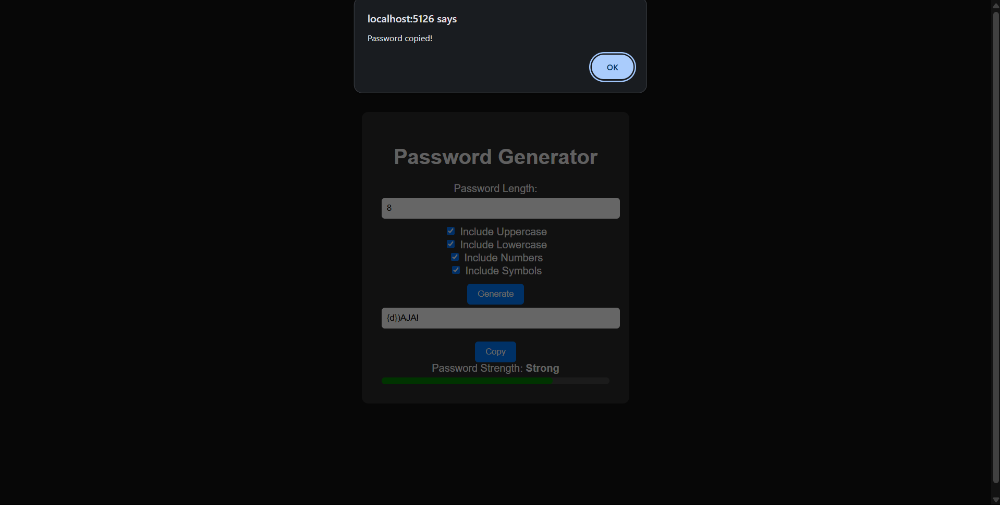
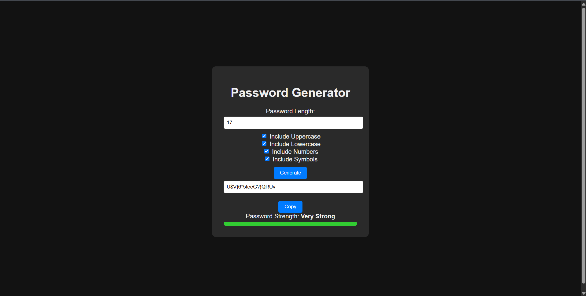

    <h1>Password Generator</h1>
    <h4>A web-based application to generate passwords and evaluate their strength</h4>
     

    

    
Content List

    <ul>
        <li>
        <a href="#about-the-project">About The Project</a>
        <ul>
            <li><a href="#built-with">Built With</a></li>
        </ul>
        </li>
        <li>
        <a href="#getting-started">Getting Started</a>
        <ul>
            <li><a href="#requirements">Requirements</a></li>
            <li><a href="#installation">Installation</a></li>
        </ul>
        </li>
        <li><a href="#snapshots">Snapshots</a></li>
    </ul>
    

    <h2><u>About the Project</u></h2>
    
This project is a web-based application designed to generate random passwords and evaluate their strength. The application allows users to generate passwords of customizable lengths and character sets, while also providing a visual indicator of the password's strength based on various criteria (such as length, complexity, and randomness). This project aims to help users create strong, secure passwords for their online accounts and services.

    <h3>Key Features:</h3>
    <ol>
        <li><b>Random Password Generation:</b></li>
        <ul>
            <li>Users can select the desired password length (e.g., between 8-20 characters).</li>
            <li>Users can choose character sets to include in the password, such as lowercase letters, uppercase letters, numbers, and special characters.</li>
            <li>The app will generate a random password that meets the selected criteria.</li>
        </ul>
        <li><b>Password Strength Evaluation:</b></li>
        <ul>
            <li>Once the password is generated, the app will assess the strength of the password based on factors such as:</li>
            <ul>
                <li>Length of the password.</li>
                <li>Inclusion of uppercase, lowercase, numbers, and special characters.</li>
                <li>The randomness of the characters in the password.</li>
            </ul>
            <li>The strength will be categorized as:</li>
            <ul>
                <li>Weak: The password is easily guessable and lacks complexity.</li>
                <li>Medium: The password is moderately complex but could be improved.</li>
                <li>Strong: The password is highly secure, with a mix of characters and sufficient length.</li>
            </ul>
        </ul>
        <li><b>Visual Password Strength Indicator:</b></li>
        <ul>
            <li>A visual meter or color-coded bar will display the password strength in real-time (e.g., red for weak, yellow for medium, green for strong).</li>
        </ul>
        <li><b>Copy to Clipboard:</b></li>
        <ul>
            <li>Users can easily copy the generated password to their clipboard for use in other applications or websites.</li>
        </ul>
    </ol>
    

        <h3>Built with:</h3>
        <ul>
            <li>Languages: HTML, CSS, JavaScript, C#</li>
            <li>Frameworks: ASP.NET Core</li>
            <li>Principles: Application Programming Interface (API)</li>
        </ul>
    

    <h2><u>Getting Started</u></h2>
    

        <h3>Requirements:</h3>
        <ul>
            <li>IDE: Visual Studio 2022</li>
            <li>OS: Windows 11</li>
            <li>Internet Connection</li>
        </ul>
    

        <h3>Installation: </h3>
        <ol>
            <li>Download the project repository</li>
            <li>Open the <i>password-generator.sln</i> with Visual Studio 2022</li>
        </ol>
    

    

    <h2><u>Snapshots</u></h2>
    
    
Run the application in <b>HTTP</b> as shown in the snapshot above

    
    
    
    

